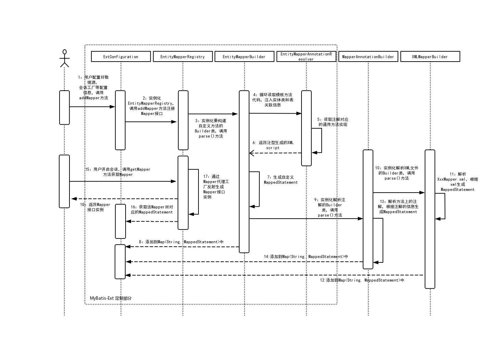

MyBatis-Ext - 方便易用的MyBatis增强扩展
---

## 概述

MyBatis-Ext是MyBatis的增强扩展，简化了MyBatis对单表增删改查的操作，提供通用的增删改查，支持函数式编程，支持分页查询，支持用户自定义通用方法，SQL无注入，集成简单，只做增强不做修改。

## 原理解析



## 快速入门

### 1. 引入Maven依赖
```xml
<dependencys>
    <!-- mybatis-ext核心模块 -->
    <dependency>
        <groupId>tech.wetech.mybatis</groupId>
        <artifactId>mybatis-ext-core</artifactId>
        <version>1.3.1</version>
    </dependency>
    <!-- springframework请引入此模块（已包含以上依赖） -->
    <dependency>
        <groupId>tech.wetech.mybatis</groupId>
        <artifactId>mybatis-ext-spring</artifactId>
        <version>1.3.1</version>
    </dependency>
    <!-- spring-boot请引入此模块（已包含以上依赖） -->
    <!-- 请注意：引入mybatis-ext-spring-boot-starter无需再引入mybatis-spring-boot-starter -->
    <dependency>
        <groupId>tech.wetech.mybatis</groupId>
        <artifactId>mybatis-ext-spring-boot-starter</artifactId>
        <version>1.3.1</version>
    </dependency>
</dependencys>
```
### 2. 在实体类添加注解
```java
//Mybatis-ext使用了Jpa的注解，目前实现了@Table、@Id、@Column、@Transient、@Version，未来考虑支持更多Jpa特性
@Table(name = "weshop_user")//指定表名，必须
public class User {
    @Id//指定Primary Key，必须
    private Integer id;
    private String username;
    private String password;
    @Column(name = "gender")//指定指定字段映射，非必须，不指定字段名驼峰转下划线
    private String gender;
    private Date birthday;
    @Column(name = "register_time")
    private Date registerTime;
    @Column(name = "last_login_time")
    private Date lastLoginTime;
    @Column(name = "last_login_ip")
    private String lastLoginIp;
    @Column(name = "user_level_id")
    private Byte userLevelId;
    private String nickname;
    private String mobile;
    @Column(name = "register_ip")
    private String registerIp;
    private String avatar;
    @Column(name = "wechat_open_id")
    private String wechatOpenId;
    @Transient//忽略该属性
    private String pageSize;
    @Transient
    private String pageNumber;
    @LogicDelete//逻辑删除
    private Integer delFlag;
    //此处省略getter，setter
}
```
### 3. 继承BaseMapper接口
```java
public interface UserMapper extends BaseMapper<User, Integer> {
  // BaseMapper<User, Integer>第一个泛型为实体类，第二个为关联主键
}
```
Mybatis-ext提供了对原生Java、Springframework以及SpringBoot的支持。
#### Ⅰ.在Java中使用
```java
public class MybatisExtTests {
    private static SqlSession sqlSession;
    private final Logger log = LoggerFactory.getLogger(MybatisExtTests.class);
    @BeforeClass
    public static void beforeClass() {
        //新建一个连接池方式的数据源工厂
        PooledDataSourceFactory pooledDataSourceFactory = new PooledDataSourceFactory();
        //设置数据源
        Properties properties = new Properties();
        properties.setProperty("driver", "<JDBC驱动>");
        properties.setProperty("url", "<JDBC URL>");
        properties.setProperty("username", "<用户名>");
        properties.setProperty("password", "<密码>");
        pooledDataSourceFactory.setProperties(properties);
        DataSource dataSource = pooledDataSourceFactory.getDataSource();
        //新建会话工厂
        TransactionFactory transactionFactory = new JdbcTransactionFactory();
        Environment environment = new Environment("development", transactionFactory, dataSource);
        Configuration configuration = new ExtConfiguration(environment); //此处使用ExtConfiguration
        configuration.setLogImpl(Log4jImpl.class);
        //添加Mapper映射
        configuration.addMapper(UserMapper.class);
        //此处使用ExtSqlSessionFactoryBuilder
        SqlSessionFactory sqlSessionFactory = new ExtSqlSessionFactoryBuilder().build(configuration);
        sqlSession = sqlSessionFactory.openSession();
    }
    @Test
    public void testSelectByPrimaryKey() {
        //根据主键查询
        UserMapper mapper = sqlSession.getMapper(UserMapper.class);
        User user = mapper.selectByPrimaryKey(1);
        log.info("selectByPrimaryKey result: {}", user);
    }
}
```
#### Ⅱ.在Springframework中使用
1、在XML中申明需要的bean，也可以使用@Bean注解来配置
```xml
<?xml version="1.0" encoding="UTF-8"?>
<beans xmlns="http://www.springframework.org/schema/beans"
       xmlns:xsi="http://www.w3.org/2001/XMLSchema-instance" xmlns:context="http://www.springframework.org/schema/context"
       xsi:schemaLocation="http://www.springframework.org/schema/beans http://www.springframework.org/schema/beans/spring-beans.xsd http://www.springframework.org/schema/context https://www.springframework.org/schema/context/spring-context.xsd">
    <!-- 配置要扫描的bean路径 -->
    <context:component-scan base-package="tech.wetech.mybatis.spring.mapper"/>
     <!-- 配置数据源 -->
    <bean id="dataSource" class="org.apache.ibatis.datasource.pooled.PooledDataSource">
        <constructor-arg value="<JDBC驱动>"/>
        <constructor-arg value="<JDBC URL>"/>
        <constructor-arg value="<JDBC用户名>"/>
        <constructor-arg value="<JDBC密码>"/>
    </bean>
    <!-- 配置会话工厂，这里用的ExtSqlSessionFactoryBean是继承了SqlSessionFactoryBean，增加了BaseMapper方法的注册 -->
    <bean id="sqlSessionFactory" class="tech.wetech.mybatis.spring.ExtSqlSessionFactoryBean">
        <property name="dataSource" ref="dataSource"/>
        <property name="mapperLocations" value="classpath*:tech/wetech/mybatis/spring/mapper/*Mapper.xml"/>
    </bean>
    <!-- 配置Mapper扫描的类 -->
    <bean class="org.mybatis.spring.mapper.MapperScannerConfigurer">
        <property name="sqlSessionFactoryBeanName" value="sqlSessionFactory"/>
        <property name="basePackage" value="tech.wetech.mybatis.spring.mapper"/>
    </bean>
</beans>
```
2、开发调用
```java
@RunWith(SpringJUnit4ClassRunner.class)
@ContextConfiguration("/beans2.xml")
public class MybatisExtSpringTests {
    private Logger log = LoggerFactory.getLogger(MybatisSpringTests.class);
    @Autowired
    private UserMapper mapper;
    @Test
    public void testSelectByExample() {
        //支持Example查询
        Example<User> example = Example.of(User.class);
        example.createCriteria()
                .andEqualTo(User::getId, 1)
                .orEqualTo(User::getUsername, "张三")
                .orNotLike(User::getAvatar, "aaa")
                .orIsNull(User::getBirthday)
                .orBetween(User::getRegisterTime, new Date(), new Date())
                .orIn(User::getMobile, Arrays.asList(111, "aaa", 222))
                .andLike(User::getAvatar, "bbb");
        example.setDistinct(true);
        example.setLimit(1);
        example.setOffset(2);
        List<User> users = mapper.selectByExample(example);
        log.info("selectByExample result: {}", users);
    }
}
```
#### Ⅲ.在SpringBoot中使用
1、在 application.properties配置文件里面添加数据源和mapper扫描路径的配置
```properties
# 此处配置数据源
spring.datasource.driver-class-name=<JDBC驱动>
spring.datasource.url=<JDBC URL>
spring.datasource.username=<用户名>
spring.datasource.password=<密码>
# 此处配置mybatis扫描路径
mybatis.mapper-locations=classpath:tech.wetech.mybatis.mapper/*Mapper.xml
```
2、在启动类上添加@MapperScan注解，指定要扫描的Mapper接口路径。
```java
@SpringBootApplication
@MapperScan(basePackages = "tech.wetech.mybatis.mapper")
public class MybatisExtSpringBootApplication {
  //此处省略main方法...
}
```
3、开发调用
```java
@RunWith(SpringRunner.class)
@SpringBootTest
public class MybatisExtSpringBootTests {
    @Autowired
    private UserMapper mapper;
    private final Logger log = LoggerFactory.getLogger(MybatisExtSpringBootTests.class);
    @Test
    public void testSelectAll() {
        log.info("log: {}", mapper.selectAll());
    }
}
```
#### Ⅳ.更多示例
```java
public class MybatisExtTests {
    //根据主键查询
    @Test
    public void testSelectByPrimaryKey() {
        User user = mapper.selectByPrimaryKey(1);
    }
    //根据主键查询，使用Optional包裹
    @Test
    public void testSelectByPrimaryKeyWithOptional() {
        User user = mapper.selectByPrimaryKeyWithOptional(1).orElseThrow(() -> new RuntimeException("未查到数据"));
    }
    //插入(包行null的值)
    @Test
    public void testInsert() {
        User user = new User();
        user.setUsername("222张三");
        user.setPassword("aagewrwer");
        user.setNickname("zhangsan");
        user.setUserLevelId((byte) 22);
        user.setMobile("180xxxxxxxx");
        user.setRegisterTime(new Date());
        user.setLastLoginTime(new Date());
        user.setLastLoginIp("127.0.0.1");
        user.setRegisterIp("127.0.0.1");
        user.setAvatar("aaaa");
        user.setWechatOpenId("222");
        int rows = mapper.insert(user);
    }
    //插入（只包含非null的值）
    @Test
    public void testInsertSelective() {
        UserMapper mapper = sqlSession.getMapper(UserMapper.class);
        User user = new User();
        user.setUsername("张三");
        user.setPassword("aagewrwer");
        user.setNickname("zhangsan");
        user.setUserLevelId((byte) 22);
        user.setMobile("180xxxxxxxx");
        user.setRegisterTime(new Date());
        user.setLastLoginTime(new Date());
        user.setLastLoginIp("127.0.0.1");
        user.setRegisterIp("127.0.0.1");
        user.setAvatar("aaaa");
        user.setWechatOpenId("222");
        int rows = mapper.insertSelective(user);
    }
    //根据主键更新(包行null的值)
    @Test
    public void testUpdateByPrimaryKey() {
        User user = new User();
        user.setId(111);
        user.setUsername("张三2223333");
        user.setPassword("aagewrwer");
        user.setNickname("zhangsan");
        user.setUserLevelId((byte) 22);
        user.setMobile("180xxxxxxxx");
        user.setRegisterTime(new Date());
        user.setLastLoginTime(new Date());
        user.setLastLoginIp("127.0.0.1");
        user.setRegisterIp("127.0.0.1");
        user.setAvatar("aaaa");
        user.setWechatOpenId("222");
        int rows = mapper.updateByPrimaryKey(user);
    }
    //根据主键更新(只包行非null的值)
    @Test
    public void testUpdateByPrimaryKeySelective() {
        UserMapper mapper = sqlSession.getMapper(UserMapper.class);
        User user = new User();
        user.setId(111);
        user.setUsername("张三");
        user.setPassword("aagewrwer");
        user.setNickname("zhangsan");
        user.setUserLevelId((byte) 22);
        int rows = mapper.updateByPrimaryKeySelective(user);
    }
    //查询所有
    @Test
    public void testSelectAll() {
        UserMapper mapper = sqlSession.getMapper(UserMapper.class);
        List<User> users = mapper.selectAll();
    }
    //查询多条数据
    @Test
    public void testSelectList() {
        User user = new User();
        user.setId(111);
        List<User> users = mapper.selectList(user);
    }
    //查询一条数据
    @Test
    public void testSelectOne() {
        User user = new User();
        user.setId(111);
        User user1 = mapper.selectOne(user);
    }
    //查询一条数据，Optional包裹
    @Test
    public void testSelectOneWithOptional() {
        User user = new User();
        user.setId(1);
        User user1 = mapper.selectOneWithOptional(user).orElseGet(() -> new User());
    }
    //根据主键判断是否存在数据
    @Test
    public void testExistsByPrimaryKey() {
        UserMapper mapper = sqlSession.getMapper(UserMapper.class);
        Boolean exists = mapper.existsByPrimaryKey(111);
    }
     //根据主键删除
     @Test
     public void testDeleteByPrimaryKey() {
        int rows = mapper.deleteByPrimaryKey(1);
     }
    //批量插入
    @Test
    public void testInsertAll() {
        User user = new User();
        user.setUsername("张三111333");
        user.setPassword("aagewrwer");
        user.setNickname("zhangsan");
        user.setUserLevelId((byte) 22);
        user.setMobile("180xxxxxxxx");
        user.setRegisterTime(new Date());
        user.setLastLoginTime(new Date());
        user.setLastLoginIp("127.0.0.1");
        user.setRegisterIp("127.0.0.1");
        user.setAvatar("aaaa");
        user.setWechatOpenId("222");
        
        User user2 = new User();
        user2.setUsername("张三222333");
        user2.setPassword("aagewrwer");
        user2.setNickname("zhangsan");
        user2.setUserLevelId((byte) 22);
        user2.setMobile("180xxxxxxxx");
        user2.setRegisterTime(new Date());
        user2.setLastLoginTime(new Date());
        user2.setLastLoginIp("127.0.0.1");
        user2.setRegisterIp("127.0.0.1");
        user2.setAvatar("aaaa");
        user2.setWechatOpenId("222");
        int rows = mapper.insertAll(Arrays.asList(user, user2));
    }
    //根据条件统计
    @Test
    public void testCount() {
        User user = new User();
        user.setId(1);
        int count = mapper.count(user);
    }
    //Criteria函数式查询
    @Test
    public void testCreateCriteria() {
        List<User> users = mapper.createCriteria()
                .andEqualTo(User::getId, 122)
                .orEqualTo(User::getUsername, "张三")
                .orNotLike(User::getAvatar, "aaa")
                .orIsNull(User::getBirthday)
                .orBetween(User::getRegisterTime, new Date(), new Date())
                .orIn(User::getMobile, Arrays.asList(111, "aaa", 222))
                .andLike(User::getAvatar, "aaa")
                .selectList();
    }
    //Example查询
    @Test
    public void testSelectByExample() {
        Example<User> example = Example.of(User.class);
        example.createCriteria()
                .andEqualTo(User::getId, 1)
                .orEqualTo(User::getUsername, "张三")
                .orNotLike(User::getAvatar, "aaa")
                .orIsNull(User::getBirthday)
                .orBetween(User::getRegisterTime, new Date(), new Date())
                .orIn(User::getMobile, Arrays.asList(111, "aaa", 222))
                .andLike(User::getAvatar, "bbb");
        example.setDistinct(true);
        example.setLimit(1);
        example.setOffset(2);
        List<User> users = mapper.selectByExample(example);
    }
    //Example统计
    @Test
    public void testCountByExample() {
        Example<User> example = Example.of(User.class);
        example.createCriteria()
                .andEqualTo(User::getId, 1)
                .orEqualTo(User::getUsername, "张三")
                .orNotLike(User::getAvatar, "aaa")
                .orIsNull(User::getBirthday)
                .orBetween(User::getRegisterTime, new Date(), new Date())
                .orIn(User::getMobile, Arrays.asList(111, "aaa", 222))
                .andLike(User::getAvatar, "select * from t_user");
        Integer rows = mapper.countByExample(example);
    }
    //Example删除
    @Test
    public void testDeleteByExample() {
        Example<User> example = Example.of(User.class);
        example.createCriteria()
                .andEqualTo(User::getId, 1)
                .orEqualTo(User::getUsername, "张三")
                .orNotLike(User::getAvatar, "aaa")
                .orIsNull(User::getBirthday)
                .orBetween(User::getRegisterTime, new Date(), new Date())
                .orIn(User::getMobile, Arrays.asList(111, "aaa", 222))
                .andLike(User::getAvatar, "select * from t_user");
        int rows = mapper.deleteByExample(example);
    }
    //Example更新（会更新null）
    @Test
    public void testUpdateByExample() {
        User user = new User();
        user.setId(999);
        user.setUsername("张三223223333");
        user.setPassword("aagewrwer");
        user.setNickname("zhangsan");
        user.setUserLevelId((byte) 22);
        user.setMobile("180xxxxxxxx");
        user.setRegisterTime(new Date());
        user.setLastLoginTime(new Date());
        user.setLastLoginIp("127.0.0.1");
        user.setRegisterIp("127.0.0.1");
        user.setAvatar("aaaa");
        user.setWechatOpenId("222");
        Example<User> example = Example.of(User.class);
        example.createCriteria()
                .andEqualTo(User::getId, 1)
                .andEqualTo(User::getUsername, "张三");
        int rows = mapper.updateByExample(user, example);
    }
    //Example更新（不会更新null）
    @Test
    public void testUpdateByExampleSelective() {
        User user = new User();
        user.setUsername("张三223223333");
        user.setPassword("aagewrwer");
        user.setNickname("zhangsan");
        Example<User> example = Example.of(User.class);
        example.createCriteria()
                .andEqualTo(User::getId, 1)
                .andEqualTo(User::getUsername, "张三");
        int rows = mapper.updateByExampleSelective(user, example);
    }
    //Example函数式查询
    @Test
    public void testCreateExample() {
        User user = mapper.createExample()
                .setDistinct(true)
                .setColumns(User::getId, User::getBirthday, User::getRegisterTime)
                .setOrderByClause("id asc,register_time desc")
                .createCriteria()
                .andEqualTo(User::getId, 1)
                .selectOneWithOptional()
                .orElseThrow(() -> new RuntimeException("数据不存在"));
    }
}
```
以上示例可以看出Mybatis-Ext对原生Mybatis并没有多大改动，只是继承了原有的类做了增强，配置上和Mybatis也相差无几。

## 目前BaseMapper\<T, PK extends Serializable\>内置的通用方法有：

- int deleteByPrimaryKey(PK id);
- \<S extends T\> int insert(S record);
- \<S extends T\> int insertAll(Iterable\<S\> record);
- \<S extends T\> int insertSelective(S record);
- \<S extends T\> S selectByPrimaryKey(PK id);
- \<S extends T\> Optional\<S\> selectByPrimaryKeyWithOptional(ID id);
- \<S extends T\> int updateByPrimaryKey(S record);
- \<S extends T\> int updateByPrimaryKeySelective(S record);
- \<S extends T\> List\<S\> selectAll();
- \<S extends T\> List\<S\> selectList(S record);
- \<S extends T\> S selectOne(S record);
- \<S extends T\> S selectOneWithOptional(S record);
- boolean existsByPrimaryKey(PK id);
- \<S extends T\> int count(S record);
- \<S extends T\> List\<S\> selectByExample(Example\<S, Object\> example);
- \<S extends T\> int countByExample(Example\<S, Object\> example);
- \<S extends T\> int deleteByExample(Example\<S, Object\> example);
- \<S extends T\> int updateByExample(@Param("record") S record, @Param("example") Example\<S, Object\> example);
- \<S extends T\> int updateByExampleSelective(@Param("record") S record, @Param("example") Example\<S, Object\> example);

如果以上不能满足业务开发需求Mybatis-ext是提供了接口支持自定义更多通用方法的：

## 如何自定义通用方法
### 1. 新建通用接口方法。通过注解指定实现类和方法
```java
import tech.wetech.mybatis.annotation.SelectEntityProvider;
public interface MyMapper<T> {
    @SelectEntityProvider(type = MyEntitySqlBuilder.class, method = "selectById")
    T selectById(Integer id);
}
```
### 2. 新建通用接口实现提供的类，注入EntityMapping参数，实现通用接口（目前支持的注入参数有EntityMapping、Configuration/ExtConfiguration）
```java
import org.apache.ibatis.jdbc.SQL;
import tech.wetech.mybatis.builder.EntityMapping;
public class MyEntitySqlBuilder {
    public String selectById(EntityMapping entityMapping) {
        return new SQL() {{
                    SELECT("*");
                    FROM(entityMapping.getTableName());
                    WHERE(entityMapping.getKeyColumn()+" = "+ " #{"+entityMapping.getKeyProperty()+"}");
                }}.toString();    
    }
}
```
### 3. 继承通用接口
```java
public interface UserMapper extends MyMapper<User> {
}
```
## 示例工程

示例工程请查阅项目mybatis-ext-simple模块，提供原生Java版、SpringMVC版、SpringBoot版集成示例。
